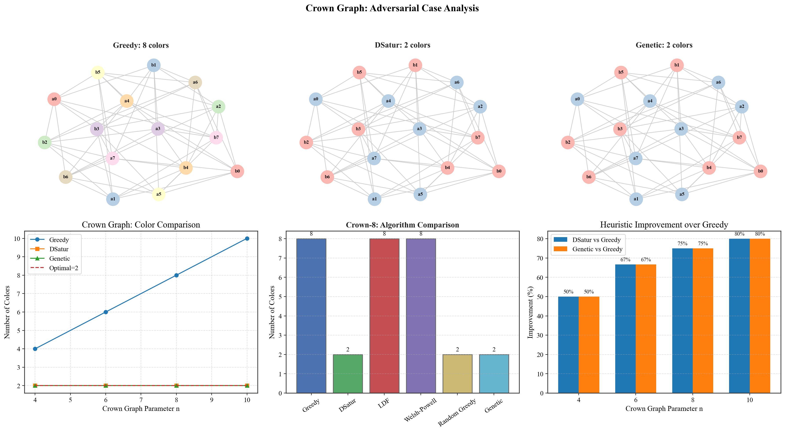
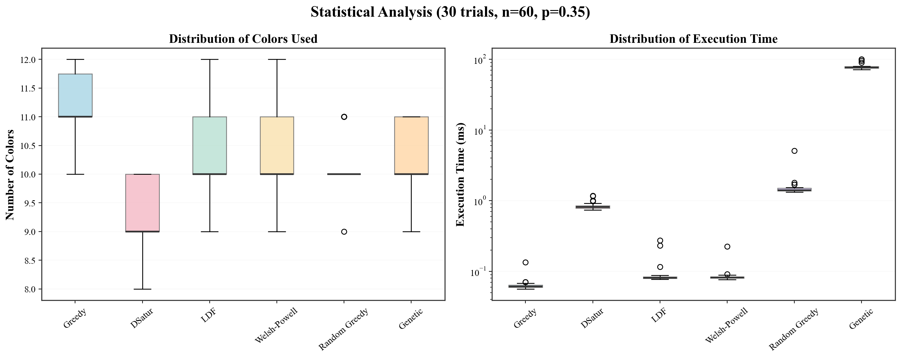

# Improved-GA-for-Graph-Coloring  

<p align="left">
  <a href="https://wku.edu.cn/en"></a>
  <a href="https://github.com/EthanYixuanMi"></a>
  <a href="https://github.com/YiduoYu"></a>
  
  <a href="LICENSE"></a>
  
  <a href="https://github.com/EthanYixuanMi/Improved-GA-for-Graph-Coloring/stargazers"></a>
</p>


A collection of classical heuristics and an improved Genetic Algorithm for solving the graph coloring problem, with full experimental evaluation and visualization.  


## Table of Contents
- [`Project Overview`](#project-overview)
- [`Key Contributions`](#key-contributions)
- [`Project Structure`](#project-structure)
- [`Experimental Setup`](#experimental-setup)
- [`Experiment Results`](#experiment-results--figures)
  - [`Experiment 1 — Random Graph Comparison`](#experiment-1--random-graph-comparison)
  - [`Experiment 2 — Challenging Graph Structures`](#experiment-2--challenging-graph-structures)
  - [`Experiment 3 — Scalability`](#experiment-3--scalability)
  - [`Experiment 4 — Density Analysis`](#experiment-4--density-analysis)
  - [`Experiment 5 — Crown Graph Analysis`](#experiment-5--crown-graph-analysis-adversarial-for-greedy)
  - [`Experiment 6 — Statistical Analysis`](#experiment-6--statistical-analysis-30-trials)
- [`How to Run`](https://github.com/EthanYixuanMi/Improved-GA-for-Graph-Coloring/blob/main/README.md#how-to-run)  
- [`Conclusion`](#conclusion)
- [`Limitations & Future Work`](#limitations--future-work)


## Project Overview

This project implements six graph coloring algorithms — ranging from simple greedy heuristics
to a customized, improved Genetic Algorithm (GA). The goal is to show how heuristic design
strongly affects solution quality, runtime, and robustness across different graph structures.

All experiments are fully reproducible, and all figures are generated automatically.  


## Key Contributions

### 1. A suite of 6 graph coloring algorithms
- Greedy  
- Largest Degree First (LDF)  
- Welsh–Powell  
- DSatur  
- Random Greedy (multi-start)  
- **Improved Genetic Algorithm (main innovation)**  

### 2. Improved GA tailored for graph coloring
Our GA is not a standard textbook GA.  
It includes several **graph-coloring–specific enhancements**:

- **Greedy-based color upper bound** to reduce search space  
- **Lexicographic fitness** prioritizing conflict elimination  
- **Repair operator** to fix invalid individuals  
- **Guided mutation** selecting colors that avoid neighbor conflicts  
- **Tournament selection + elitism** for stable convergence  

### 3. Five categories of input graphs
Random graphs, Mycielski graphs, Crown graphs, adversarial graphs, bipartite-like graphs.

### 4. Six comprehensive experiments with visualization
All figures saved under `img/`.


## Project Structure
```
graph_coloring_project/
│
├─ main.py                      # Entry point: runs all experiments
├─ requirements.txt             # Python dependencies
│
└─ graph_coloring/
   ├─ __init__.py
   ├─ algorithms.py             # Implementations of all 6 algorithms
   ├─ graph_generators.py       # Random, crown, mycielski, adversarial...
   ├─ evaluation.py             # Unified algorithm runner + validity check
   ├─ visualization.py          # Plot functions (bar charts, graph layouts)
   └─ experiments.py            # All six experiments (exp1–exp6)
│
└─ img/                         # Auto-created: all experiment figures saved here
```  

### Quick Links to Source Files
- [`graph_coloring/algorithms.py`](graph_coloring_project/graph_coloring/algorithms.py)
- [`graph_coloring/graph_generators.py`](graph_coloring_project/graph_coloring/graph_generators.py)
- [`graph_coloring/evaluation.py`](graph_coloring_project/graph_coloring/evaluation.py)
- [`graph_coloring/visualization.py`](graph_coloring_project/graph_coloring/visualization.py)
- [`graph_coloring/experiments.py`](graph_coloring_project/graph_coloring/experiments.py)
- [`main.py`](graph_coloring_project/main.py)


## Experimental Setup

We evaluate all algorithms across six experiments:

1. Random graph comparison  
2. Challenging graph structures  
3. Scalability with graph size  
4. Density analysis  
5. Crown graph adversarial test  
6. Statistical analysis over 30 trials  

All figures are automatically generated and saved in the `img/` directory.


## Experiment Results & Figures  

### Experiment 1 — Random Graph Comparison

This experiment compares all six algorithms on a random G(n,p) graph with n=80, p=0.35.
We observe:

- Greedy uses the most colors (14)
- DSatur performs best with 11 colors
- Our Genetic Algorithm achieves 12 colors
- Runtime difference is dramatic: GA is the slowest, greedy the fastest

#### Figure: Algorithm Outputs + Performance Comparison  
  

### Experiment 2 — Challenging Graph Structures

We evaluate on four structured graphs:
- Mycielski-5 (chromatic number = 5)
- Crown-8 (adversarial for greedy)
- Adversarial-30 graph
- Bipartite-like noisy graph

Observations:
- All algorithms reach optimal 5 colors on Mycielski-5
- Greedy completely fails on Crown-8 (uses 8 colors instead of 2)
- GA and DSatur both achieve optimal solutions for Crown graphs

#### Figure: Algorithm behavior on structured graphs (Mycielski, Crown, Adversarial, Bipartite-like)  


### Experiment 3 — Scalability

Tested n ∈ {30, 50, 80, 100, 150, 200} on random graphs with p=0.3.

Results:
- DSatur consistently uses fewer colors as n grows
- GA performance is good but computationally expensive
- Greedy is fastest but quality degrades with graph size

#### Figure: Scalability of color usage and runtime as graph size increases   


### Experiment 4 — Density Analysis

We vary the density p from 0.1 to 0.7.
As density increases:
- All algorithms require more colors
- DSatur remains the most robust
- GA stays competitive but slow

#### Figure: Impact of edge density on color requirements and runtime   


### Experiment 5 — Crown Graph Analysis (Adversarial for Greedy)

Crown graphs are bipartite and 2-colorable, but greedy performs extremely poorly:
- Greedy uses n colors on Crown-n
- DSatur and GA always find optimal 2 colors

This experiment highlights the importance of using intelligent heuristics.

#### Figure: Performance on Crown graphs (worst-case for greedy)  


### Experiment 6 — Statistical Analysis (30 Trials)

We run 30 independent trials on random graphs (n=60, p=0.35).

Results:
- DSatur shows the most stable behavior (lowest standard deviation)
- GA performs well but with high runtime variance
- Greedy fluctuates but remains fast

#### Figure: Distribution of color counts and runtimes over 30 trials  



## How to Run

### 1. Install dependencies  
Make sure Python 3.8+ is installed. Then run:

```bash
pip install -r requirements.txt
```

### 2. Run all experiments
```bash
python main.py
```

This will automatically:

- Generate all experiment figures  
- Save them under `img/`  
- Print summary statistics in the terminal  

### 3. Running specific experiments
You may edit `main.py` or directly call functions in
`graph_coloring/experiments.py` to run individual experiments.


## Conclusion
This project demonstrates how different heuristic strategies behave on the graph coloring problem,
ranging from simple greedy rules to more sophisticated methods such as DSatur and our improved GA.

Key findings:

- **Greedy algorithms are extremely fast but unreliable**, especially on adversarial structures.
- **DSatur is the strongest classical heuristic**, consistently achieving the fewest colors.
- **Our improved Genetic Algorithm shows competitive or superior coloring performance**, especially on complex or adversarial graphs.
- Although GA is computationally expensive, it provides a **robust alternative** when greedy-based heuristics fail or when solution quality is prioritized over speed.

Overall, the experiments highlight that **algorithmic design matters**:  
small heuristic improvements can dramatically change solution quality and stability.


## Limitations & Future Work

While the improved GA delivers strong coloring results, it has several limitations:

### Current Limitations
- **High runtime cost** compared to greedy and DSatur  
- **Variance in performance** across different runs due to stochastic operators  
- **Not optimized for very large graphs** (n > 500)
- **Mutation operator is purely random**, which sometimes leads to unstable convergence.

### Future Extensions
- **Hybrid DSatur + GA approach**  
  DSatur can generate high-quality initial populations, improving GA convergence.

- **Local search integration (Tabu Search / Hill-Climbing)**  
  Adding local refinement steps can reduce color conflicts more efficiently.

- **Parallelized GA**  
  Evaluating individuals in parallel (multiprocessing / GPU) can significantly reduce runtime.

- **Testing on DIMACS benchmark datasets**  
  Allows comparison with state-of-the-art coloring algorithms.

- **Implementing crossover operators tailored to graph structure**  
  Could further reduce conflicts and color count.

- **Learning‑based mutation (GA + Reinforcement Learning / Machine Learning)**
  Since the current mutation operator selects colors randomly, future work can explore learning‑guided mutation strategies.
  For example, a reinforcement learning agent can learn which color assignments are likely to reduce conflicts based on graph structure, or a small neural model can predict promising mutation actions.
  This hybrid GA+ML direction could make mutation more adaptive, reduce randomness, and improve convergence stability on difficult graphs.

  These improvements would make the GA both **faster** and **more scalable**, while maintaining its
  advantage of producing high-quality colorings on difficult graph families.


## References  

[1] D. J. A. Welsh and M. B. Powell, “An upper bound for the chromatic number of a graph and its application to timetabling problems,” *The Computer Journal*, vol. 10, no. 1, pp. 85–86, 1967.

[2] D. Brélaz, “New methods to color the vertices of a graph,” *Communications of the ACM*, vol. 22, no. 4, pp. 251–256, 1979.

[3] P. San Segundo, “A new DSATUR-based algorithm for exact vertex coloring,” *Computers & Operations Research*, vol. 39, no. 7, pp. 1724–1733, 2012.

[4] C. Fleurent and J. A. Ferland, “Genetic and hybrid algorithms for graph coloring,” *Annals of Operations Research*, vol. 63, no. 3, pp. 437–461, 1996.

[5] A. E. Eiben, J. K. Van Der Hauw, and J. I. van Hemert, “Graph coloring with adaptive evolutionary algorithms,” *Journal of Heuristics*, vol. 4, no. 1, pp. 25–46, 1998.

[6] P. Galinier and J.-K. Hao, “Hybrid evolutionary algorithms for graph coloring,” *Journal of Combinatorial Optimization*, vol. 3, no. 4, pp. 379–397, 1999.

[7] A. E. Eiben and J. E. Smith, *Introduction to Evolutionary Computing*. Springer, 2015.

[8] M. R. Garey and D. S. Johnson, *Computers and Intractability*. W. H. Freeman, 2002.

[9] T. R. Jensen and B. Toft, *Graph Coloring Problems*. John Wiley & Sons, 2011.

[10] G. J. Chaitin, “Register allocation & spilling via graph coloring,” *ACM SIGPLAN Notices*, vol. 17, no. 6, pp. 98–101, 1982.

[11] P. Galinier and A. Hertz, “A survey of local search methods for graph coloring,” *Computers & Operations Research*, vol. 33, no. 9, pp. 2547–2562, 2006.

[12] E. Cantú-Paz, *Efficient and Accurate Parallel Genetic Algorithms*, vol. 1. Springer, 2000.

[13] D. S. Johnson and M. A. Trick, *Cliques, Coloring, and Satisfiability: Second DIMACS Implementation Challenge, October 11–13, 1993*, vol. 26. American Mathematical Society, 1996.


